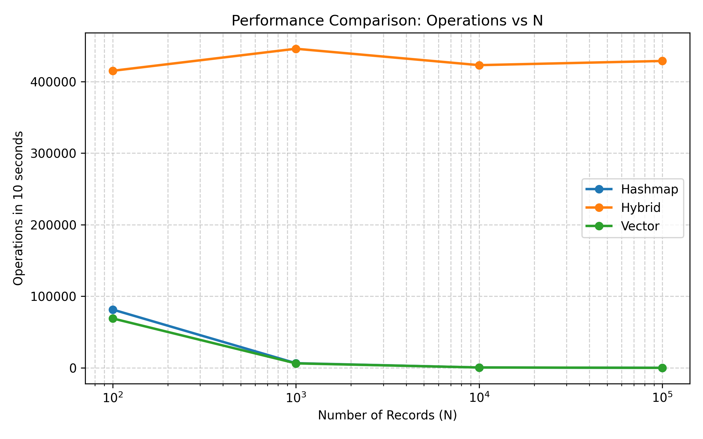
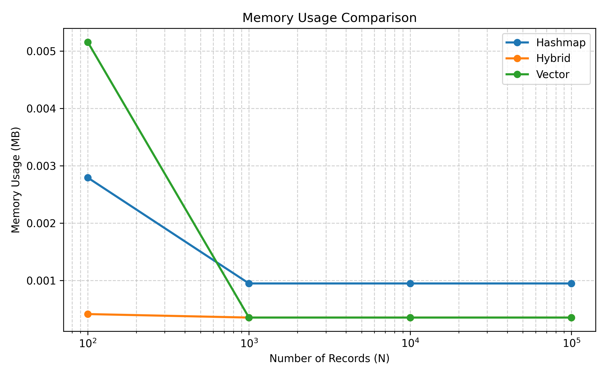

# Algorithms and Data Structures — Homework №1

### 🔹 DatabaseVector
Реалізація на основі **`std::vector<Student>`**.  
Усі елементи зберігаються послідовно в пам’яті, пошук здійснюється через повний перебір.  
- **Складність пошуку:** O(n)  
- **Оновлення рейтингу:** O(n)  
- **Пошук групи з найбільшим середнім рейтингом:** O(n)

Це найпростіша реалізація, але через лінійні операції при великому обсязі даних продуктивність стрімко падає.

### 🔹 DatabaseHashmap
Реалізація на основі **`std::unordered_map<std::string, Student>`**,  
де ключем виступає email студента.  
Це дозволяє миттєво знаходити та оновлювати записи.

- **Пошук або зміна за email:** O(1)  
- **Аналіз груп:** O(n), бо потрібно пройтись по всіх значеннях

Така структура значно швидша за вектор, але має більший обсяг пам’яті  
через використання хеш-таблиці .

### 🔹 DatabaseHybrid — найефективніша реалізація 💎
Поєднує **`unordered_map`** для швидкого доступу до студентів за email  
та **`vector`** для ітераційного обходу при обчисленні середніх значень і пошуку топових студентів.

- **Зміна рейтингу за email:** O(1)  
- **Пошук топ-100 студентів:** O(n log 100) ≈ O(n)  
- **Знаходження групи з найвищим середнім рейтингом:** O(n)

Ця структура забезпечує баланс між швидкістю та пам’яттю:  
усі часто виконувані операції виконуються за сталий або майже сталий час,  
а одночасно зберігається можливість швидко аналізувати всі записи через вектор.  
Саме **DatabaseHybrid** показала найкращі результати в експерименті.

### Графік 1 — Кількість операцій за 10 секунд
- Hybrid показує найкращу стабільну продуктивність — кількість операцій залишається високою навіть при великих об’ємах.

- Vector та Hashmap помітно сповільнюються зі зростанням кількості записів,
особливо при великих розмірах бази 

- Це пояснюється тим, що Hybrid поєднує швидкий доступ через хеш-таблицю
та зручне послідовне зберігання у векторі.

### Графік 2 — Використання пам’яті

- Hybrid виявився найекономнішим за пам’яттю,
оскільки уникає дублювання даних між різними структурами.

- Hashmap споживає трохи більше пам’яті через хеш-таблицю.

- Vector використовує більше пам’яті для малих обсягів даних
через внутрішні алокації, але при великих N стабілізується.

### 3) Порівняння алгоритмів сортування

Я реалізувала два варіанти сортування студентів за email-адресами:

стандартне std::sort,

та власну реалізацію Radix Sort.

У моїй реалізації Radix Sort спочатку визначається максимальна довжина email,
щоб знати, скільки позицій потрібно пройти.
Далі для кожної позиції (починаючи з останнього символу) виконується Counting Sort,
де підраховуються символи, обчислюються їх позиції та стабільно розміщуються елементи.
Після кожного проходу порядок оновлюється.
Складність такого підходу — O(k·n), де k — середня довжина email.

Після оптимізації я перестала копіювати самі об’єкти студентів,
а сортувала лише їхні індекси — це зробило алгоритм у кілька разів швидшим.
Тим не менш, під час експериментів виявилось, що
стандартна функція std::sort у C++ працює ще швидше,
оскільки вона дуже добре оптимізована для рядкових даних
і не виконує зайвих копій об’єктів.

Результати експерименту:

std::sort time:  46.086 ms
Radix Sort time: 169.395 ms

Отже, хоча Radix Sort має лінійну теоретичну складність,
на практиці для рядкових полів (як email)
краще працює вбудоване сортування C++,
а власна реалізація корисна для розуміння принципів роботи сортування без порівнянь.
